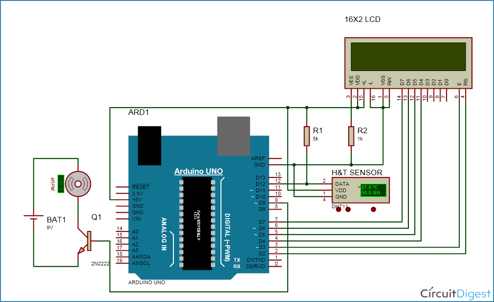

# Temperature-Controlled-Fan

      This is a simple program to automate the speed of the fan using Arduino Uno. In this project, we are 
going to control DC fan speed according to the room temperature and show these parameter changes on a 16x2
LCD display. It is accomplished by the data communications between Arduino, LCD, DHT11 sensor Module and DC
fan that is controlled by using PWM.  
       Here the DHT11 senses temperature, the microcontroller(ATMEGA328P) reads the dht11 sensor module’s 
output and extracts temperature value into a suitable number in Celsius scale and control the fan speed by
using PWM. Also the data is displayed on the LCD.
     

